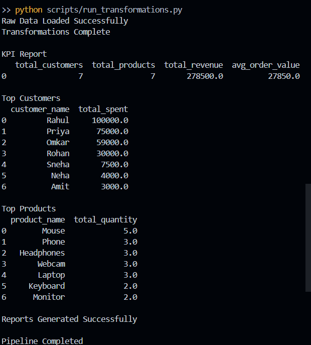
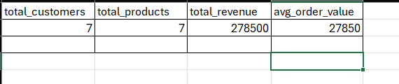
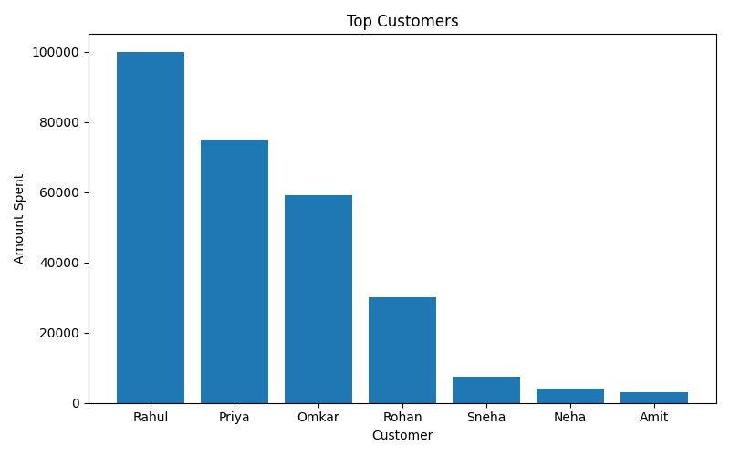
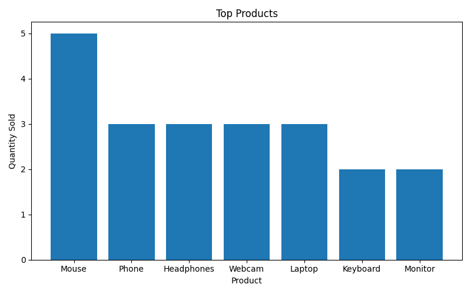
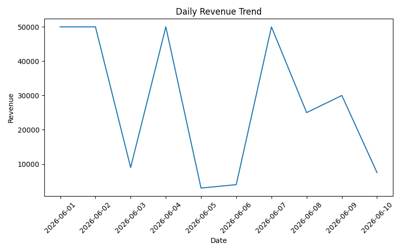

# Amazon E-Commerce ELT Pipeline

## Overview

This project demonstrates an End-to-End ELT (Extract, Load, Transform) Data Engineering pipeline using Python, DuckDB, SQL, and Pandas.

The pipeline loads raw customer, product, and order datasets into a data warehouse, performs SQL-based transformations, builds a star schema, and generates analytical reports for business intelligence.

---

## Project Architecture

```text
Customers CSV
Products CSV
Orders CSV
        ↓
Python Data Loader
        ↓
DuckDB Data Warehouse

raw_customers
raw_products
raw_orders

        ↓
SQL Transformations

dim_customers
dim_products
dim_date
fact_sales

        ↓
Analytics Reports
        ↓
CSV Outputs & Visualizations
```

---

## ELT Workflow

### Extract

Raw CSV datasets are collected from source files.

### Load

Raw data is loaded directly into DuckDB warehouse tables:

* raw_customers
* raw_products
* raw_orders

### Transform

SQL transformations create analytical tables:

* dim_customers
* dim_products
* dim_date
* fact_sales

---

## Star Schema

```text
                 dim_customers
                        |
                        |
dim_date ------- fact_sales ------- dim_products
```

### Fact Table

* fact_sales

### Dimension Tables

* dim_customers
* dim_products
* dim_date

---

## Technologies Used

* Python
* Pandas
* DuckDB
* SQL
* Matplotlib
* Git
* GitHub

---

## Features

### Data Loading

* Load customer data
* Load product data
* Load order data

### Data Warehousing

* Raw layer
* Dimension tables
* Fact tables

### Business Analytics

* Total Revenue
* Top Customers
* Top Products
* Revenue by Category
* Revenue by City
* Daily Sales Trend
* Customer Ranking

### Reporting

Exports reports as CSV files.

### Visualization

Generates charts automatically.

---

## Project Structure

```text
amazon-ecommerce-elt-pipeline/

├── data/
│   ├── customers.csv
│   ├── products.csv
│   └── orders.csv
│
├── scripts/
│   ├── load_data.py
│   └── run_transformations.py
│
├── sql/
│   └── transformations.sql
│
├── output/
│   ├── ecommerce.db
│   ├── kpi_report.csv
│   ├── sales_report.csv
│   ├── top_customers.csv
│   ├── top_products.csv
│   ├── revenue_by_category.csv
│   ├── revenue_by_city.csv
│   ├── daily_sales.csv
│   ├── top_customers.png
│   ├── top_products.png
│   └── daily_sales_trend.png
│
├── screenshots/
├── README.md
├── requirements.txt
└── etl.log
```

---

## Pipeline Execution

Run:

```bash
python scripts/load_data.py

python scripts/run_transformations.py
```

Expected Output:

```text
Raw Data Loaded Successfully
Transformations Complete
Reports Generated Successfully
Pipeline Completed
```

---

## Generated Reports

### KPI Report

* Total Customers
* Total Products
* Total Revenue
* Average Order Value

### Customer Analytics

* Top Customers
* Customer Ranking

### Product Analytics

* Top Products
* Revenue by Category

### Sales Analytics

* Revenue by City
* Daily Revenue Trend

---

## Screenshots

### Pipeline Execution



### KPI Dashboard



### Top Customers



### Top Products



### Daily Revenue Trend



---

## Skills Demonstrated

* ELT Pipeline Development
* Data Warehousing
* SQL Transformations
* Star Schema Design
* Fact & Dimension Modeling
* Data Analytics
* Data Visualization
* Business Intelligence Reporting
* Git & GitHub

---

## Future Improvements

* PostgreSQL Integration
* Apache Airflow Scheduling
* Incremental Loading
* Data Quality Framework
* Cloud Deployment
* Dashboard Integration (Power BI/Tableau)

---

## Author

**Omkar Yeram**

Aspiring Data Engineer | Python | SQL | Data Warehousing | ETL/ELT Pipelines
